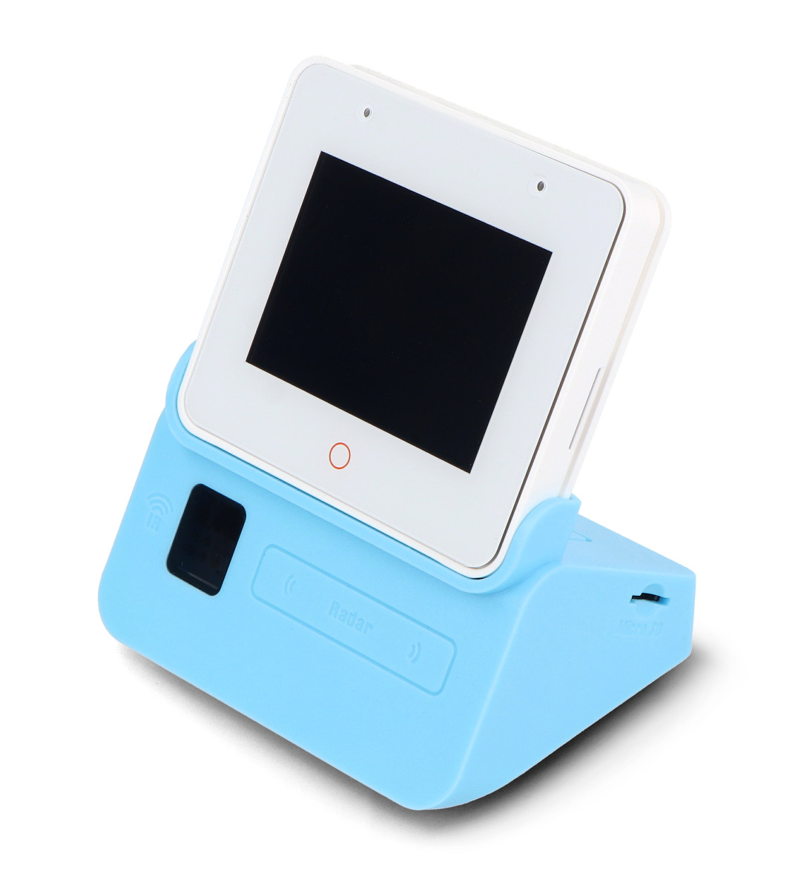

# box3-assistant

<p align="center">
  
  
  
  
  
  
</p>



`box3-assistant` is an ESP32-S3-BOX-3 firmware project for a networked voice assistant terminal.

This firmware image boots directly on the BOX-3 and acts as a smart front end for home and media integrations. This is a basic device
that is created to share as little data as possible with 3rd parties. As the device grows in features flags will be added to disable
integrations such as ChatGPT so data sharing stays limited.

<br clear="right" />

## Table Of Contents

- [Overview](#overview)
- [Status](#status)
- [Architecture](#architecture)
- [Design Docs](#design-docs)
- [Wake Word And Commands](#wake-word-and-commands)
- [Development Setup](#development-setup)
- [Secrets](#secrets)
- [Wi-Fi Credentials](#wi-fi-credentials)
- [Weather Configuration](#weather-configuration)
- [Local TTS Configuration](#local-tts-configuration)
- [Local STT Configuration](#local-stt-configuration)
- [Tests](#tests)

## Overview

| Icon | Item | Details |
| --- | --- | --- |
| 🧠 | Device | ESP32-S3-BOX-3 |
| 🛠 | Firmware stack | ESP-IDF |
| 🎙 | Wake word | `Hi ESP` |
| 💡 | Integrations | Philips Hue, pluggable weather provider, local Piper TTS, and dynamic voice timers |
| 🖥 | Output | On-device status, weather screens, timer countdown/alarm UI, and optional local TTS |
| 🧪 | Validation | Host-side unit tests and firmware builds |

## Status

The project currently includes:

✅ ESP-IDF based firmware for the ESP32-S3-BOX-3  
✅ Speech model loading and local command detection  
✅ Wi-Fi configuration hooks  
✅ Hue bridge control path  
✅ Weather commands for a configurable location  
✅ On-device weather display with multiline forecast details  
✅ Optional local Piper TTS playback for weather responses  
✅ Dynamic timer commands backed by local LAN STT  
✅ Timer countdown display and local alarm chime with direct `stop` handling  
✅ Persisted assistant diagnostics for timeout and reboot debugging  
✅ Host-side unit tests for assistant state, command labeling, weather formatting, timer parsing/runtime, and Wyoming STT protocol helpers

Planned future work includes broader assistant speech reuse, richer UI, ChatGPT-backed interactions, and Jellyfin/media support.

## Architecture

The firmware is currently organized around a small set of runtime-oriented modules:

| Module | Responsibility |
| --- | --- |
| `main/box3_assistant.c` | Boot flow, task startup, and top-level assistant orchestration |
| `main/assistant_runtime.h` | Shared in-memory `assistant_runtime_t` state passed through assistant helpers and tasks |
| `main/hue/hue_command_runtime.c` | Load stored Hue groups, sync groups from the bridge, and rebuild the runtime speech command table |
| `main/assistant_command_text.c` | Format user-facing labels for built-in and Hue-backed commands |
| `main/assistant_state.c` | Pure assistant state and timeout decision helpers |
| `main/assistant_diagnostics.c` | Persist lightweight reboot and command breadcrumbs for post-restart debugging |
| `main/timer/timer_parse.c` | Parse transcribed timer durations and format countdown text |
| `main/timer/timer_runtime.c` | Track active timer countdown and alarm state |
| `main/stt/local_stt_client.c` | Low-level local STT client for Wyoming `faster-whisper` follow-up transcription |
| `main/stt/local_stt_protocol.c` | Pure Wyoming event parsing helpers used by the STT client and unit tests |
| `main/net/line_socket.c` | Shared LAN socket helpers used by local TTS and local STT clients |
| `main/tts/local_tts_client.c` | Low-level local TTS client, including Piper socket-event synthesis and legacy HTTP/WAV handling |
| `main/tts/tts_player.c` | Generic device speech facade used by assistant commands to speak text through the BOX-3 speaker |
| `main/weather/weather_client.c` | Provider-agnostic weather facade used by the assistant flow and UI |
| `main/weather/weather_open_meteo_provider.c` | Default Open-Meteo weather provider implementation behind the weather facade |

## Design Docs

Current design notes in `docs/`:

📄 Ask GPT Design  
📄 Jellyfin Option 1 Design  
📄 Local Weather TTS Design With Piper
📄 Timer Design With Local STT

## Wake Word And Commands

The expected boot flow after flashing is:

1. boot the firmware
2. connect to Wi-Fi
3. load the speech models
4. automatically refresh Hue groups once from the bridge
5. fall back to the last saved group list if the Hue refresh fails
6. enter standby and wait for the wake word

The current assistant interaction flow is:

1. wait in standby for the wake word
2. wake up and listen for one command
3. execute the command
4. show the result on screen
5. return to standby

Timer requests use a short follow-up capture flow instead of a giant static phrase table:

1. say `Hi ESP`
2. say `set a timer`
3. the device records a short follow-up clip such as `1 minute 30 seconds`
4. the clip is sent to a local Wyoming `faster-whisper` service on the LAN
5. the firmware parses the returned text into seconds and starts the timer
6. the countdown stays visible until expiry, then the device plays a local chime until it hears `stop`

If a weather, Hue, or TTS request stalls during execution, the firmware now attempts to cancel the active request first. If that recovery does not finish within a short grace window, the device falls back to a restart.

On the next boot, the firmware logs the previous command diagnostics and briefly shows a short `Prev ...` message on screen when the prior run ended in a notable timeout or reboot during command handling.

### Quick Reference

| Icon | Area | Current behavior |
| --- | --- | --- |
| 🎙 | Wake word | `Hi ESP` |
| 🔄 | Built-in commands | `update groups from hue`, `weather today`, `weather tomorrow`, `set a timer`, `stop` |
| 💡 | Dynamic commands | `turn on <group>`, `turn off <group>` |
| ⏱ | Timer follow-up | Captures a short duration phrase and transcribes it with local Wyoming STT |
| ⚠ | Timeout handling | Cancel active network or TTS work first, then restart only if recovery stalls |
| 🧾 | Weather failure text | `Weather network error`, `Weather timeout`, `Weather unavailable` |

Current wake word:

- `Hi ESP`

Current always-available voice commands:

- `update groups from hue`
- `weather today`
- `weather tomorrow`
- `set a timer`
- `stop`

On boot, the firmware now automatically attempts a Hue group refresh after Wi-Fi connects so a newly flashed device can rebuild its group command list without requiring a manual sync. The `update groups from hue` command is still available to force a refresh later.

After a successful sync, the firmware fetches the Hue groups list from the bridge, normalizes the spoken names, saves the accepted groups to the `storage` partition, and rebuilds the active MultiNet command table.

The firmware now prefers local Hue bridge discovery and caches the discovered bridge IP for later boots. `CONFIG_HUE_BRIDGE_IP` is no longer required for normal operation. If you set it, it is used only as an optional seed or fallback when discovery has not succeeded yet.

After a successful sync, the firmware supports commands like:

- `turn on living room`
- `turn off living room`
- `turn on kitchen`
- `turn off office`

Saying `weather today` or `weather tomorrow` causes the firmware to:

1. fetch the requested forecast for the configured location from the active weather provider over HTTPS
2. display a multiline weather summary on the BOX-3 screen
3. optionally speak the forecast through the local TTS player when Piper is configured
4. keep the weather screen visible for about 30 seconds total, including time spent speaking
5. return to standby

The current default provider is Open-Meteo, but the firmware now routes weather fetches through a provider boundary so another backend can be swapped in without changing the main assistant command flow or weather UI formatting.

Transient connection failures are retried automatically. Weather network failures show `Weather network error`, and execution-time cancellation recovery shows `Weather timeout`.

The current weather display format is:

- `Now in <location>` for `weather today`, or `Tomorrow in <location>` for `weather tomorrow`
- current condition and current temperature for `weather today`
- daily high and low
- wind speed for `weather today`
- precipitation chance

The weather result screen does not show the generic `COMMAND COMPLETED` banner. It displays only the weather details for the requested day.

Saying `set a timer` causes the firmware to:

1. capture a short mono PCM follow-up clip
2. send it to the configured Wyoming STT endpoint
3. parse phrases such as `20 seconds`, `1 minute`, or `1 minute 30 seconds`
4. start a countdown timer and keep it visible on screen
5. play a local chime repeatedly when the timer expires
6. stop the alarm immediately when the device hears `stop`

Current limits:

- only the first 6 usable Hue groups are added as direct voice commands
- group names are normalized into simple spoken forms before they become commands
- synced groups persist across power cycles, but you may need to resync after reflashing if the `storage` partition is erased or rewritten
- weather location is configurable through local sdkconfig values
- spoken weather requires a reachable local Piper-compatible TTS service
- dynamic timers require a reachable local Wyoming-compatible STT service
- only one timer is supported at a time
- timers do not persist across reboot
- the current BOX-3 playback path keeps I2S output at 16 kHz to match the active microphone/AFE path, so higher-rate Piper audio is downsampled on-device until server-side 16 kHz output is added

## Development Setup

Recommended local tooling:

- ESP-IDF activated through `fish` with `get_idf`
- `clang-format` for C/C++ formatting
- `make` for common repo tasks

On Ubuntu, install `clang-format` with:

```bash
sudo apt update
sudo apt install clang-format
```

Verify it is available:

```bash
clang-format --version
```

The repo includes a root [`.clang-format`](./.clang-format) for C/C++ formatting.

If `clang-format` is installed locally, you can format a file with:

```bash
clang-format -i main/hue/hue_client.c
```

Or format multiple touched C/C++ files at once:

```bash
clang-format -i main/*.c main/**/*.c main/**/*.h tests/*.c
```

To format the whole repo using the checked-in file list, run:

```bash
./scripts/format.sh
```

The formatter binary is not bundled with this repo, so install it through your system package manager and use the checked-in config.

Common repo tasks are also available through `make`:

```bash
make format
make test
make build
make deploy
```

`make deploy` uses `/dev/ttyACM0` by default. Override the serial port with:

```bash
make deploy PORT=/dev/ttyUSB0
```

## Secrets

To avoid committing real Wi-Fi passwords, Hue API keys, or other credentials these are stored in the config.

Recommended options:

- use `idf.py menuconfig` and keep secrets in `sdkconfig` only
- or create a local `sdkconfig.defaults.local` file based on sdkconfig.defaults.local.example

Both `sdkconfig` and `sdkconfig.defaults.local` are ignored by git.

| Icon | File | Purpose |
| --- | --- | --- |
| 🔒 | `sdkconfig.defaults.local` | Untracked local seed values for secrets and overrides |
| ⚙ | `sdkconfig` | Generated effective build configuration |

Important distinction:

- `sdkconfig.defaults.local` is a local input file that seeds config values
- `sdkconfig` is the generated effective config that ESP-IDF actually builds with

That means your Wi-Fi password can exist in `sdkconfig` locally even if you only typed it into `sdkconfig.defaults.local`. That is expected. The important part is that neither file is committed.

If `sdkconfig` already contains stale values, ESP-IDF will keep using them until you regenerate it. In that case, remove `sdkconfig` and `sdkconfig.old`, then reconfigure with your local defaults file enabled.

If you want to build with a local defaults override file in `fish`, run:

```fish
cd /home/<user-name>/projects/esp-projects/box3-assistant
get_idf
set -x SDKCONFIG_DEFAULTS "sdkconfig.defaults;sdkconfig.defaults.local"
rm -f sdkconfig sdkconfig.old
idf.py reconfigure
idf.py build
```

In `bash`, use `export` instead:

```bash
cd /home/<user-name>/projects/esp-projects/box3-assistant
export SDKCONFIG_DEFAULTS="sdkconfig.defaults;sdkconfig.defaults.local"
rm -f sdkconfig sdkconfig.old
idf.py reconfigure
idf.py build
```

For flashing with the same local override in `fish`:

```fish
cd /home/<user-name>/projects/esp-projects/box3-assistant
get_idf
set -x SDKCONFIG_DEFAULTS "sdkconfig.defaults;sdkconfig.defaults.local"
rm -f sdkconfig sdkconfig.old
idf.py reconfigure
idf.py -p /dev/ttyACM0 flash monitor
```

## Wi-Fi Credentials

You can set Wi-Fi credentials in either of these ways:

1. `idf.py menuconfig`
2. a local `sdkconfig.defaults.local` file

| Option | Best for | Notes |
| --- | --- | --- |
| `idf.py menuconfig` | One-off local configuration | Writes values into generated `sdkconfig` |
| `sdkconfig.defaults.local` | Repeatable local builds | Best for machine-specific secrets and overrides |

For the local file workflow:

```fish
cd /home/<user-name>/projects/esp-projects/box3-assistant
cp sdkconfig.defaults.local.example sdkconfig.defaults.local
```

Then edit `sdkconfig.defaults.local` and set:

```text
CONFIG_HUE_WIFI_SSID="your-ssid"
CONFIG_HUE_WIFI_PASSWORD="your-password"
CONFIG_HUE_BRIDGE_API_KEY="your-hue-api-key"
```

Optional Hue setting:

```text
CONFIG_HUE_BRIDGE_IP="192.168.68.60"
```

That bridge IP is now optional. The firmware can discover the Hue bridge on your LAN and cache the discovered address, so you usually only need Wi-Fi credentials and the Hue API key.

When building or flashing from a fresh shell, include the local defaults file and regenerate `sdkconfig` if needed:

```fish
cd /home/<user-name>/projects/esp-projects/box3-assistant
get_idf
set -x SDKCONFIG_DEFAULTS "sdkconfig.defaults;sdkconfig.defaults.local"
rm -f sdkconfig sdkconfig.old
idf.py reconfigure
grep CONFIG_HUE_WIFI_SSID sdkconfig
grep CONFIG_HUE_WIFI_PASSWORD sdkconfig
idf.py build
```

Or to flash and monitor:

```fish
cd /home/<user-name>/projects/esp-projects/box3-assistant
get_idf
set -x SDKCONFIG_DEFAULTS "sdkconfig.defaults;sdkconfig.defaults.local"
rm -f sdkconfig sdkconfig.old
idf.py reconfigure
grep CONFIG_HUE_WIFI_SSID sdkconfig
grep CONFIG_HUE_WIFI_PASSWORD sdkconfig
idf.py -p /dev/ttyACM0 flash monitor
```

The `set -x SDKCONFIG_DEFAULTS ...` command only applies to the current shell session. The credentials stored in `sdkconfig.defaults.local` remain on disk, but you need to set the environment variable again in each new terminal. If `grep` still shows empty strings, the build is not using your local defaults file yet.


## Weather Configuration

The weather command target is configurable through `menuconfig` or your local `sdkconfig.defaults.local` file.

The tracked defaults currently point at Open-Meteo, but `CONFIG_WEATHER_BASE_URL` is now labeled and treated as the active weather provider base URL rather than an Open-Meteo-only setting.

Config values available through `menuconfig`:

- `CONFIG_WEATHER_BASE_URL`
- `CONFIG_ASSISTANT_LOCATION_NAME`
- `CONFIG_WEATHER_LATITUDE`
- `CONFIG_WEATHER_LONGITUDE`
- `CONFIG_WEATHER_TIMEZONE`
- `CONFIG_WEATHER_TIMEOUT_MS`

### Tracked Project Defaults

| Setting | Default |
| --- | --- |
| Base URL | `https://api.open-meteo.com` |
| Location name | `New York City, NY` |
| Latitude | `40.7128` |
| Longitude | `-74.0060` |
| Timezone | `America/New_York` |
| Timeout | `8000` ms |

For the untracked local-file workflow, add weather settings to `sdkconfig.defaults.local` alongside your Wi-Fi values:

```text
CONFIG_ASSISTANT_LOCATION_NAME="New York City, NY"
CONFIG_WEATHER_LATITUDE="40.7128"
CONFIG_WEATHER_LONGITUDE="-74.0060"
CONFIG_WEATHER_TIMEZONE="America/New_York"
```

For this repo, the intended setup is:

- tracked project default: `New York City, NY`
- local machine override example: edit your untracked `sdkconfig.defaults.local` to whatever location you actually want, such as `Fargo, ND`

The firmware also enables the ESP certificate bundle in tracked defaults so HTTPS weather requests can validate the remote certificate.

Note: the firmware uses Espressif's built-in `Hi, ESP` WakeNet model (`wn9s_hiesp`) for this wake-word flow. Say `Hi ESP` when testing the current firmware.

## Local TTS Configuration

Local speech output is optional. The current implementation targets a Piper service running on the LAN and is used by weather responses through the reusable `tts_player_speak()` facade.

The working Piper integration uses a raw TCP socket event protocol, not HTTP. The firmware sends one newline-terminated JSON request:

```json
{"type":"synthesize","data":{"text":"Today in Fargo..."}}
```

It then reads newline-delimited events such as `audio-start`, `audio-chunk`, and `audio-stop`. `audio-chunk` events include binary PCM payloads, which the firmware streams directly to the speaker path instead of buffering the entire utterance in RAM.

Config values available through `menuconfig`:

- `CONFIG_TTS_PIPER_ENABLED`
- `CONFIG_TTS_PIPER_BASE_URL`
- `CONFIG_TTS_PIPER_EVENT_SOCKET`
- `CONFIG_TTS_PIPER_TIMEOUT_MS`
- `CONFIG_TTS_PIPER_VOLUME_PERCENT`

Recommended local defaults:

```text
CONFIG_TTS_PIPER_BASE_URL="http://tts-server.local:10200"
CONFIG_TTS_PIPER_EVENT_SOCKET=y
CONFIG_TTS_PIPER_TIMEOUT_MS=20000
CONFIG_TTS_PIPER_VOLUME_PERCENT=85
```

`CONFIG_TTS_PIPER_BASE_URL` is still used for host and port parsing in socket mode. The scheme is ignored by the socket client, but keeping `http://host:port` makes the value compatible with the legacy HTTP path.

Volume is controlled at speaker-codec initialization by `CONFIG_TTS_PIPER_VOLUME_PERCENT`. Increase or decrease that value in `sdkconfig.defaults.local` or through `menuconfig`, then rebuild and flash.

## Local STT Configuration

Dynamic timers use a local Wyoming speech-to-text service on the LAN. The current implementation is designed around `wyoming-faster-whisper`.

Unlike the Piper HTTP-compatible setting, the STT socket setting should be a raw `host:port` value because the firmware speaks Wyoming TCP directly.

Config values available through `menuconfig`:

- `CONFIG_LOCAL_STT_ENABLED`
- `CONFIG_LOCAL_STT_BASE_URL`
- `CONFIG_LOCAL_STT_TIMEOUT_MS`
- `CONFIG_LOCAL_STT_CAPTURE_MS`
- `CONFIG_TIMER_MAX_DURATION_SECONDS`

Recommended local defaults:

```text
CONFIG_LOCAL_STT_ENABLED=y
CONFIG_LOCAL_STT_BASE_URL="stt-server.local:10300"
CONFIG_LOCAL_STT_TIMEOUT_MS=30000
CONFIG_LOCAL_STT_CAPTURE_MS=3000
CONFIG_TIMER_MAX_DURATION_SECONDS=86400
```

Notes:

- `CONFIG_LOCAL_STT_BASE_URL` should not include `http://`
- the current STT path expects 16 kHz, 16-bit, mono PCM follow-up audio
- the first request may be slower if the server is still loading the model
- timer parsing is intentionally narrow and currently focuses on minute/second phrases

## Tests

Host-side unit tests cover assistant state-machine decisions, command-label formatting, weather formatting regressions, timer parsing/runtime, and Wyoming STT protocol helpers, including the recovery logic for:

- listening timeout recovery
- repeated missing AFE fetch recovery
- empty MultiNet result recovery
- assistant session timeout recovery
- built-in and Hue command label formatting
- timer duration parsing and countdown formatting
- timer wraparound-safe runtime behavior
- Wyoming transcript and error event classification

The host test target does not currently exercise the ESP-IDF HTTP stack, persisted diagnostics module, or request-cancellation path.

Run them with:

```bash
./tests/run_unit_tests.sh
```

Or from the build tree:

```bash
cmake --build build --target unit-tests
```
