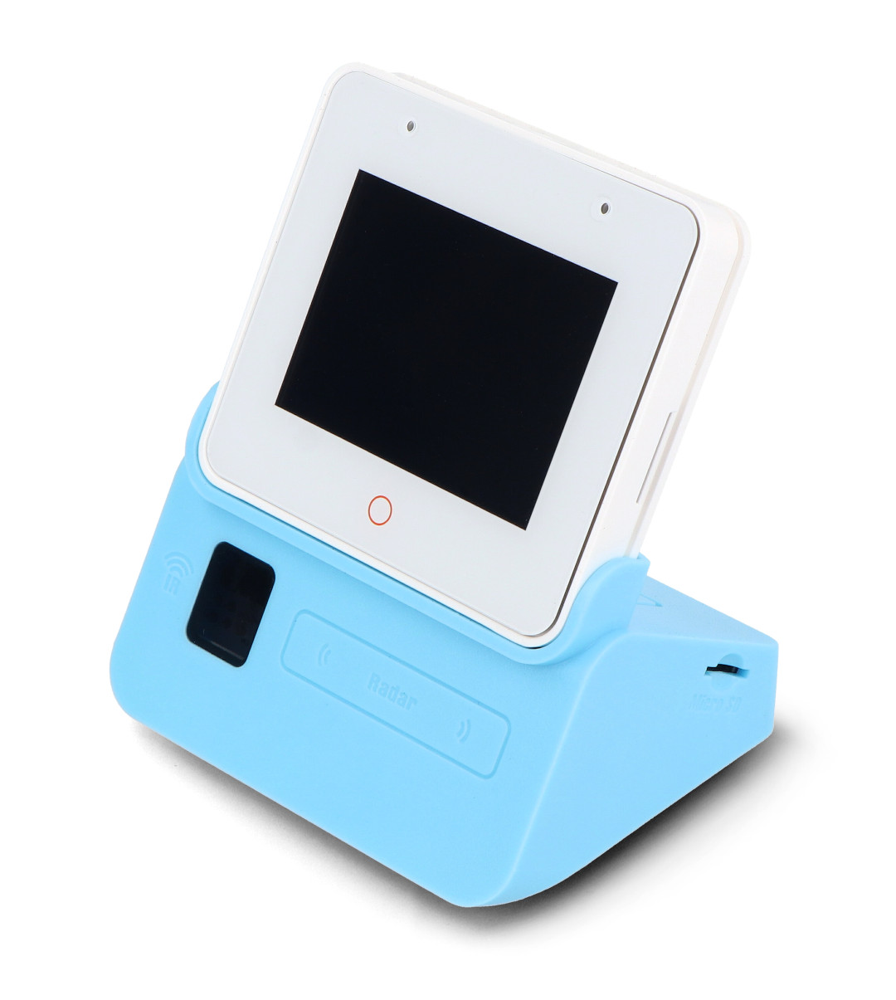

# box3-assistant

<p align="center">
  
  
  
  
  
  
</p>



`box3-assistant` is an ESP32-S3-BOX-3 firmware project for a networked voice assistant terminal.

This firmware image boots directly on the BOX-3 and acts as a smart front end for home and media integrations. This is a basic device
that is created to share as little data as possible with 3rd parties. As the device grows in features flags will be added to disable
integrations such as ChatGPT so data sharing stays limited.

<br clear="right" />

## Table Of Contents

- [Overview](#overview)
- [Status](#status)
- [Documentation](#documentation)
- [Development Setup](#development-setup)

## Overview

| Icon | Item | Details |
| --- | --- | --- |
| 🧠 | Device | ESP32-S3-BOX-3 |
| 🛠 | Firmware stack | ESP-IDF |
| 🎙 | Wake word | `Hi ESP` |
| 💡 | Integrations | Philips Hue, pluggable weather provider, local Piper TTS, and dynamic voice timers |
| 🖥 | Output | On-device status, weather screens, timer countdown/alarm UI, and optional local TTS |
| 🧪 | Validation | Host-side unit tests and firmware builds |

## Status

The project currently includes ESP-IDF based firmware for the ESP32-S3-BOX-3 with local command detection, Wi-Fi configuration, Hue control, configurable weather commands, optional local Piper TTS, dynamic timers backed by local LAN STT, on-device status displays, persisted diagnostics, and host-side unit tests.

Planned future work includes broader assistant speech reuse, richer UI, ChatGPT-backed interactions, and Jellyfin/media support.

## Documentation

User and setup documentation:

- [User guide](docs/user-guide.md)
- [Configuration](docs/configuration.md)

Current design notes:

- [Ask GPT Design](docs/ask-gpt-design.md)
- [Jellyfin Option 1 Design](docs/jellyfin-option-1-design.md)
- [Local Weather TTS Design With Piper](docs/weather-tts-piper-design.md)
- [Timer Design With Local STT](docs/timer-stt-design.md)

## Development Setup

Recommended local tooling:

- ESP-IDF v6.0.2
- ESP-IDF activated through `fish` with `$HOME/.espressif/v6.0.2/esp-idf/export.fish`
- `clang-format` for C/C++ formatting
- `make` for common repo tasks

Common repo tasks:

```bash
make format
make test
make build
make rebuild
make deploy
```

Host-side unit tests can also be run directly:

```bash
./tests/run_unit_tests.sh
```

`make deploy` uses `/dev/ttyACM0` by default. Override the serial port with:

```bash
make deploy PORT=/dev/ttyUSB0
```
